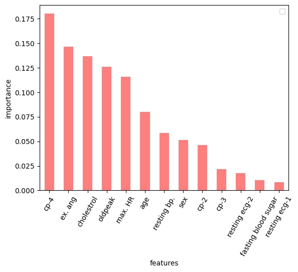

# Classification and Prediction of Heart Disease in Patients

## 1. Business Understanding
The objective of this project is to develop a machine learning model that can predict the susceptibility of patients to heart disease based on several factors that can be monitored during health checks. This can be used as an early detection mechanism to improve patient outcomes and/or to prevent the occurance of such disease by doing more frequenct health checks or through life style changes. To this end, we use the UCI Heart Disease Dataset to develop, train and evaluate a machine learning model.

The notebook is organized as follows: in Section 2, I use descriptive statistics and several visualizations to examine the dataset, develop a better understanding of the features and identify any cleaning or modifications that may be required. Next, I clean the data and address any missing values to prepare the data for building a model. In Section 3, several machine learning models (logistic regression, decision trees and in the end an ensemble method, a random forest method) are built, trained and evaluated based on unified performance metrics. The best model is identified. Section 4 summarizes the performance of the models built in tables and makes three recommendations to stakeholders based on the findings of this study. Section 5 lists the limitations of the current study as well as avenues that one may explore to improve the performance of the model.

## 2. Data Understanding and Analysis

## 3. Results and Recommendations
| Model   | Accuracy   | Precision  | Recall  | $f_1$  | Top-5 Important Features |
|-----|---|---|---|------| --------- |
| Logistic Regression  | 0.78  | 0.85  | 0.71  | 0.77  | oldpeak, thalach, cp-4, chol, sex |
| Decision Tree  | 0.73  | 0.77  | 0.67  |  0.72 | cp-4, chol, age, oldpeak, trestbps |
| Random Forest  | 0.81  | 0.84  | 0.78  | 0.81  | thalach, cp-4, chol, oldpeak, age |

1. The random forest model has the best performance metrics among the tree tested. This is the model we should use for predicting whether a patient is prone to cardiovascular events that may need monitoring in the future. 
2. The following features are consistently listed as important by two or all classification algorithms:
    - cp4: asymptomatic chest pain type. 
    - chol: serum cholestoral in mg/dl. Elevated levels of cholestrol can cause buildup in the arteries and therefore are associated with heart disease. 
    - oldpeak: ST depression induced by exercise relative to rest. This factor is strongly associated with ischemia and can be a predictor of heart disease. 
    - thalch: maximum heart rate achieved. Lower peak heart rates during stress tests are often indicative of cardiovascular issues.

**Figure 1.** Feature importances based on the random forest model, which is the model with the best performance. 
    
3. Age and sex are also among the other top-5 important features identified by the algorithms. 

## 4. Limitations and Next Steps
1. The feature *oldpeak* has a heavily right-skewed distribution as shown in the plots above. Logistic regression assumes normal distribution for the features. Therefore its model assumptions are violated and its predictions may be inaccurate. Moreover, models like decision trees and the random forest method can get affected by such skewedness. In this case, outlier values can dominate the behavior of the model and affect the splits as well as feature importance. A more robust study would use techniques such as logarithmic transformation to reduce skewness in variables and then use them as features. 
2. In the context of this problem, having false positives is better than having false negatives since if a patient is flagged for susceptibility to heart disease, they will only need more check-ups. However, if they're not flagged while being high-risk, an unnoticed heart disease may occur with serious consequences for the patient. This means that recall is more important to us compared to precision. Therefore, one could repeat the hyperparameter tuning exercises using "recall" as the metric to optimize for.
3. Other powerful methods such as K-Means clustering or neural networks may be explored for improving the performance.